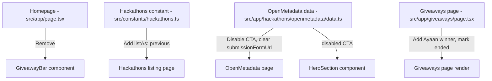

# Design Document

## Overview

This design covers the changes needed to mark the OpenMetadata "Back to the Metadata" hackathon and the iPad giveaway as ended across the WeMakeDevs website. The work is entirely content and configuration driven — no new components, APIs, or data models are introduced. The changes span six files across four pages: the Homepage, the Hackathons listing page, the OpenMetadata hackathon detail page, and the Giveaways page.

The approach follows existing patterns already established in the codebase. Other ended hackathons (e.g., 2fast2mcp, accomplish, tambo) use the `listAs: "previous"` field in the hackathons constant array. The HeroSection already supports a `disabled` CTA state. The giveaways page already has a past winners grid that accepts new entries.

## Architecture

No architectural changes are required. The existing Next.js App Router structure, component hierarchy, and data flow patterns remain unchanged.



All changes are leaf-level edits to existing files. No new files are created (except the Ayaan image which already exists). No shared utilities or components are modified in ways that affect other pages.

## Components and Interfaces

### Files Modified

| File | Change Summary |
|------|---------------|
| `src/app/page.tsx` | Remove GiveawayBar import, remove `GIVEAWAY_END_DATE` constant, remove `showGiveawayBar` logic, remove conditional bottom padding, remove `<GiveawayBar />` render |
| `src/constants/hackathons.ts` | Add `listAs: "previous"` to the OpenMetadata hackathon entry |
| `src/app/hackathons/openmetadata/data.ts` | Set `cta.disabled: true`, set `submissionFormUrl: ""` |
| `src/app/hackathons/openmetadata/page.tsx` | No code change needed — the existing conditional `{DATA.submissionFormUrl && (...)}` already handles hiding the submit CTA banner when `submissionFormUrl` is falsy |
| `src/app/hackathons/openmetadata/components/HeroSection.tsx` | No code change needed — the existing `cta.disabled` check already renders a disabled button, and the existing `{submissionFormUrl && (...)}` conditional already hides the Submit Project link |
| `src/app/giveaways/page.tsx` | Import Ayaan image, add Ayaan to `pastWinners` array, replace "Live Now" badge with "Ended" badge, replace hero pill text, disable the survey button, remove ping animation, add newsletter prompt message |

### Change Details

#### 1. Homepage (`src/app/page.tsx`)

**Before:**
```tsx
import GiveawayBar from "@/components/GiveawayBar";
const GIVEAWAY_END_DATE = "2026-04-26T23:59:59";

export default function Home() {
  const showGiveawayBar = new Date() < new Date(GIVEAWAY_END_DATE);
  return (
    <div className={showGiveawayBar ? "pb-[5.5rem] sm:pb-24" : undefined}>
      {/* ... */}
      {showGiveawayBar && <GiveawayBar />}
    </div>
  );
}
```

**After:**
```tsx
export default function Home() {
  return (
    <div>
      {/* ... all existing components except GiveawayBar ... */}
    </div>
  );
}
```

Remove the GiveawayBar import, the `GIVEAWAY_END_DATE` constant, the `showGiveawayBar` variable, the conditional padding class, and the conditional GiveawayBar render.

#### 2. Hackathons Constant (`src/constants/hackathons.ts`)

Add `listAs: "previous"` to the OpenMetadata entry in the `hackathons` array. This follows the same pattern used by tambo, 2fast2mcp, and the February hackathon entries.

```ts
{
  slug: openmetadataData.slug,
  title: openmetadataData.title,
  description: openmetadataData.descriptionCard,
  thumbnail: openmetadataImages.thumbnail,
  startDate: openmetadataData.startDate,
  endDate: openmetadataData.endDate,
  listAs: "previous",
},
```

The listing page's `useMemo` logic already handles `listAs: "previous"` — it filters these entries into the "Previous Hackathons" section and excludes them from "Upcoming Hackathons".

#### 3. OpenMetadata Data (`src/app/hackathons/openmetadata/data.ts`)

```ts
cta: {
  label: "Register Now",
  href: "https://forms.gle/gogMB2AjCbeFQdZZ8",
  openInNewTab: true,
  disabled: true,  // changed from false
},
submissionFormUrl: "",  // changed from the Google Forms URL
```

This is sufficient because:
- The HeroSection already checks `cta.disabled` and renders a non-clickable div with `opacity-60 cursor-not-allowed pointer-events-none` when true.
- The HeroSection already checks `{submissionFormUrl && (...)}` to conditionally render the "Submit Project" link.
- The main page already checks `{DATA.submissionFormUrl && (...)}` to conditionally render the "Submit your project" CTA banner.

#### 4. Giveaways Page (`src/app/giveaways/page.tsx`)

**Add Ayaan to past winners:**
```tsx
import ayaanImage from "./images/Ayaan.png";

const pastWinners = [
  {
    image: ayaanImage,
    name: "Ayaan",
    prize: "Apple iPad",
    worth: "₹50,000",
  },
  // ... existing winners
];
```

Ayaan is placed first in the array so the most recent winner appears first in the grid.

**Mark giveaway as ended:**

Replace the hero pill badge:
- Change `"🎉 Live Giveaway"` → `"Giveaway Ended"`
- Change the pill styling from emerald animated to a neutral/muted style

Replace the "Live Now" badge:
- Change from the animated green "Live Now" badge to a static "Ended" badge
- Remove the `animate-ping` span that creates the pulsing green dot

Replace the CTA button:
- Change from a clickable `<Link>` to a disabled `<div>` or `<button disabled>`
- Change text from "Fill the Survey & Enter" to "This Giveaway Has Ended"
- Apply muted/disabled styling (reduced opacity, no hover effects)

**Add newsletter prompt:**

Add a line of text below the disabled CTA button:
```tsx
<p className="text-sm text-slate-400 mt-3">
  Stay updated via our newsletter below for future giveaways!
</p>
```

The existing `<Newsletter />` component at the bottom of the page is retained as-is.

## Data Models

No data model changes. All modifications are to existing inline data objects and JSX. The `HackathonType` type in `src/constants/hackathons.ts` already supports the optional `listAs` field. The `pastWinners` array is an inline constant with no shared type definition.

## Error Handling

No new error handling is needed. All changes are static content updates. The existing conditional rendering patterns (`{condition && <Component />}`) already handle falsy values gracefully.

## Testing Strategy

### Why Property-Based Testing Does Not Apply

This feature consists entirely of:
- Removing a component from a page (GiveawayBar)
- Toggling boolean/string flags in data objects (`disabled: true`, `submissionFormUrl: ""`)
- Adding a static entry to an array (Ayaan winner)
- Updating static text and CSS classes (badge text, button state)

There are no pure functions, data transformations, algorithms, or business logic being added or modified. The input space is fixed (specific flag values, specific text strings). There is nothing to universally quantify over — "for all X, property P(X) holds" does not apply to any of these changes.

### Recommended Testing Approach

**Visual / Manual Testing:**
- Verify the Homepage no longer shows the GiveawayBar or extra bottom padding
- Verify the Hackathons listing page shows OpenMetadata under "Previous Hackathons"
- Verify the OpenMetadata page shows a disabled register button and no submit links
- Verify the Giveaways page shows Ayaan in the past winners grid
- Verify the Giveaways page shows "Ended" badges and a disabled survey button
- Verify the newsletter prompt text appears on the Giveaways page

**Build Verification:**
- Run `npm run build` (or the project's build command) to confirm no TypeScript errors, no broken imports, and no build failures after the changes

**Smoke Tests (if a test framework is configured):**
- Render the Homepage and assert GiveawayBar is not in the DOM
- Render the Giveaways page and assert "Ayaan" appears in the past winners section
- Render the Giveaways page and assert "This Giveaway Has Ended" text is present
- Render the OpenMetadata page and assert the register button has disabled styling
